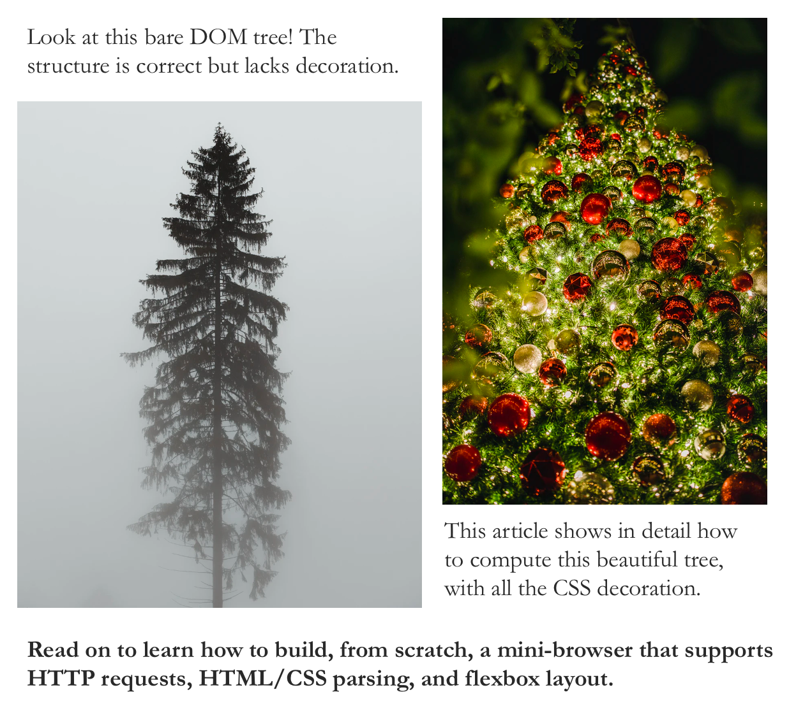
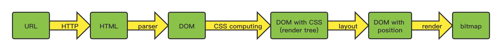

# mini-browser
A toy browser built from scratch that supports HTTP requests, HTML/CSS parsing, and flexbox layout. Sample code for the article: Understanding how browsers work by creating one (TODO add the link).

